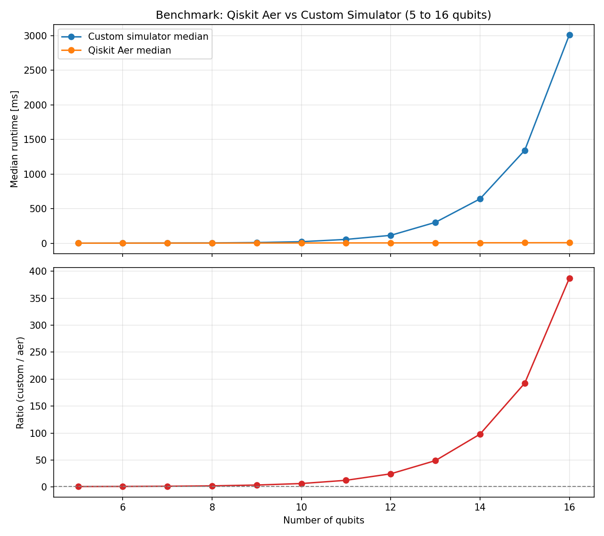
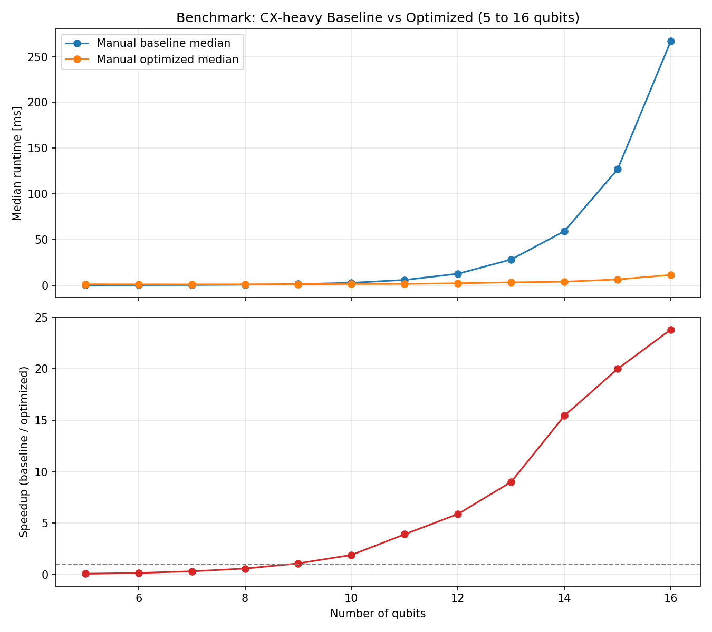
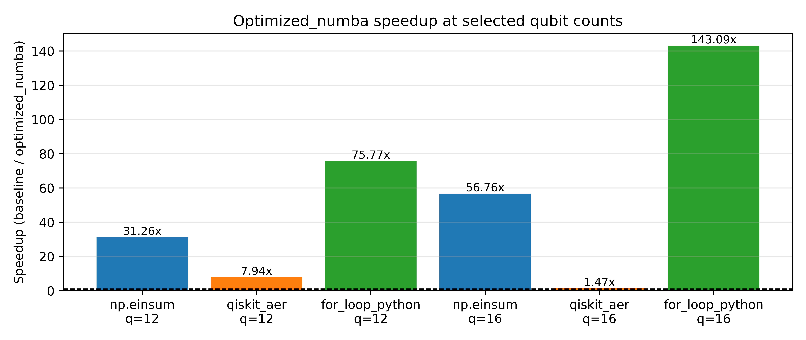

Benchmark Results
=================

This page compares median runtime across two benchmark groups for
qubit counts from 5 to 16.

Both benchmark paths append ``save_statevector()`` after transpilation to ensure
the documented results represent statevector-save workflow overhead consistently.

The published plots on this page focus on CPU/Aer baselines. GPU simulator
results are hardware-dependent and should be measured locally when relevant.

The ratio curve is defined as:

custom runtime / aer runtime

For the cx-heavy-runtime group, the speedup curve is defined as:

manual-baseline runtime / manual-optimized runtime

How the data was produced
-------------------------

1. Run benchmark tests and export JSON:
   uv run pytest -q -k benchmark --benchmark-group-by=param:n_qubits --benchmark-sort=name --benchmark-json docs/_static/benchmark_results_q5_16.json
2. Generate median plots from the JSON export:
   uv run python docs/plot_benchmark.py

Notebook benchmark workflow
---------------------------

For interactive benchmarking and correctness checks, use:

``docs/notebooks/statevector_benchmark_comparison.ipynb``

The notebook compares three methods on the same random circuits:

1. ``mocked_statevector`` (Qiskit reference)
2. ``CustomSimulatorManualOptimized(cx_backend="python")``
3. ``CustomSimulatorManualOptimized(cx_backend="numba")``

It includes:

1. A per-run comparison table (runtime and max statevector error vs reference)
2. A qubit-sweep runtime plot
3. A speedup plot for optimized python vs optimized numba backends

Use this notebook when you want to inspect trend behavior and correctness
in one place before exporting static benchmark JSON.

Simulator Runtime Median Plot
-----------------------------

CX-Heavy Median Plot
--------------------

Numba Speedup Summary Plot
--------------------------

Interpretation
--------------

The median curves show two clear trends:

1. In the simulator-runtime benchmark, the custom manual simulator is competitive
   only at very small sizes and then diverges strongly from Aer as qubit count
   increases. The custom/aer ratio rises rapidly for larger systems.

2. In the CX-heavy benchmark, the optimized simulator has some fixed overhead at
   very small sizes (around 5 to 8 qubits), but then overtakes the baseline and
   scales significantly better. From roughly 10 qubits onward, the speedup grows
   quickly and reaches a large improvement at 16 qubits.

3. Practical takeaway: for tiny circuits, baseline/manual execution can still be
   fine. The optimized implementation is intended for general transpiled
   ``u``/``cx`` workloads, and the CX-heavy plot highlights one stress-case where
   its scaling advantage is easy to see.

4. Notebook plot takeaway: in the sweep plots, the optimized numba backend
   should remain below optimized python in runtime for larger qubit counts,
   while all methods should remain numerically aligned with the Qiskit
   reference up to global phase.
