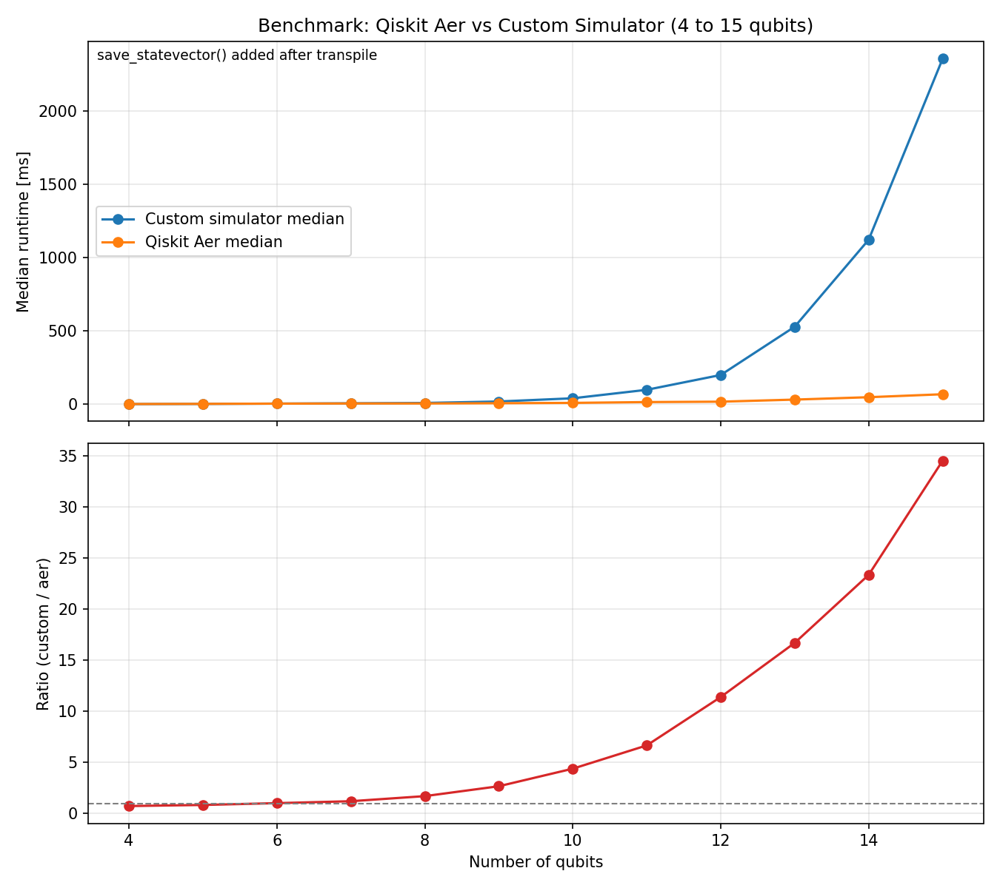

Benchmark Results
=================

This page compares median runtime of the custom simulator and Qiskit Aer for
qubit counts from 4 to 15.

Both benchmark paths append ``save_statevector()`` after transpilation to ensure
the documented results represent statevector-save workflow overhead consistently.

The ratio curve is defined as:

custom runtime / aer runtime

How the data was produced
-------------------------

1. Run the benchmark tests and export JSON:
   uv run pytest -q -k benchmark --benchmark-group-by=param:n_qubits --benchmark-sort=name --benchmark-json docs/_static/benchmark_results_q4_15.json
2. Generate the plot from the JSON export:
   uv run python docs/plot_benchmark.py

Benchmark Plot
--------------

